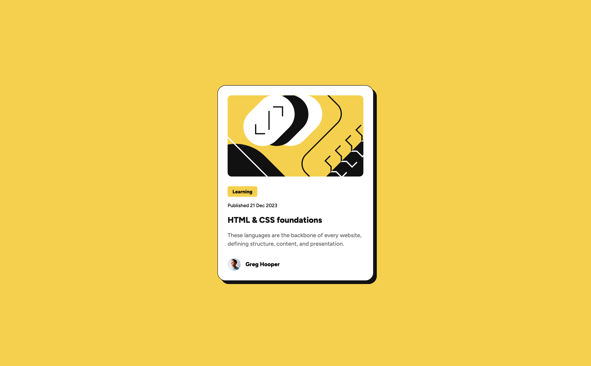

# Frontend Mentor - Blog preview card solution

A mini project to test my HTML & CSS skills. This is a solution to the [Blog preview card challenge on Frontend Mentor](https://www.frontendmentor.io/challenges/blog-preview-card-ckPaj01IcS).

## Screenshot

## Links
- [Source](https://github.com/mothy-08/fm-blog-preview-card)
- [Live](https://mothy-08.github.io/fm-blog-preview-card/)

## Built with
- HTML
- CSS
